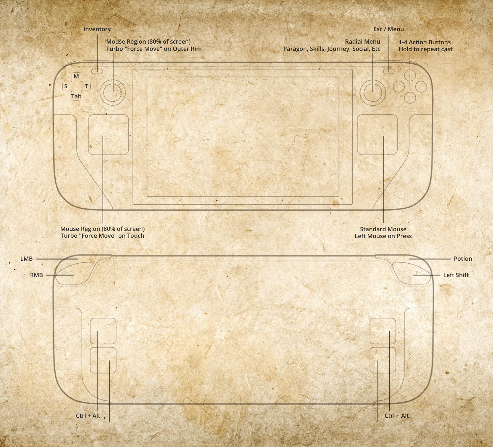

# Diablo 3 on Deck Readme
This is a guide on how best to use my controller configuration for Diablo 3 on the Steam Deck.

Diablo 3 on console has excellent controls (and some great QOL changes), but Blizzard are yet to bring them over to the PC client. I've spent many hours tinkering with the configuration to get it to a stage of being very close to emulating the console controls.

## Recommended skill setup/usage
I find that using the left track pad feels more natural than using the joystick as it's hard to be precise with the joystick due to dead zone, but easy with the trackpad. Both options are there however. When moving and aiming with the left stick or trackpad, hold L2 to force you to stand still when casting any abilities.

Any buffs or cooldown abilities should be bound in your 1-4 slot. If you are at end-game and need these abilities to trigger repeatedly or whenever they are off cooldown, then hold the AXYB buttons for 500ms to toggle re-casting of them every 1s. Just remember you will need to disable this automatic re-casting by toggling the ability again when you try to port back to town.

If you use any channeled skills, they must be bound to RMB (R2) or LMB (R1) because holding any of the face buttons will trigger a repeating press of those buttons rather than holding it which will break your channel.

## Installing Layout
<!-- ##### Easy option -->
1. Name your non-Steam Diablo 3 shortcut "Diablo III"
1. Look in Community Layouts for "Diablo III for Deck" by "trankillity"
1. Apply the layout and enjoy!
<!-- ##### Harder option
1. Paste this URL into a browser in desktop mode on your Steam Deck - 
1.  -->
> If you are having trouble, feel free to reach out to me on the Steam Deck discord.

## Important Diablo 3 settings
* Bind Force Move to Mouse Wheel Down (used for forcing movement and allowing the client to look like those who use the Logitech mouse trick)
* Bind all other keys to default
* Set "Voice" volume to 0 (or you will get many "Not enough rage/mana/hatred" error lines)

## Basic bindings
* Left track pad or joystick for an absolute mouse region around your character
* Touching left track pad will turbo repeat the force move binding
* Moving the left joystick to the outer ring position will turbo repeat force move binding
* Clicking the left joystick will toggle repeat force move binding
* Right trackpad for standard mouse
* AXYB = 1,2,3,4 abilities respectively
* R2 for Right Mouse Button
* R1 for Left Mouse Buton
* L2 for hold position/Shift
* L1 for potion
* "Menu" for Esc/Menu
* "View" for Inventory
* L4/R4 for Alt/Ctrl (both at same time)

## Advanced bindings
* Hold AXYB in order to toggle repeating of these buttons (Equivalent to Numlock trick on PC)

## To-do
* [Docs] Video demonstrating all the controls.
* [Docs] Upload raw config file for people to download directly.
* [Docs] Guide on how to install raw config file.
* [Config] One-button repair.
* [Config] One-button salvage.
* [Config] Force the "stand still" button to cancel auto-move if it's enabled.
* [Config] Consider moving "stand still" button to reclaim another trigger.
